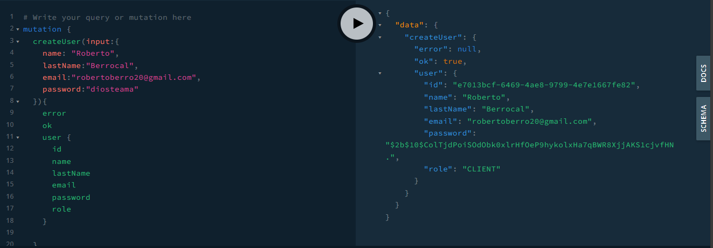
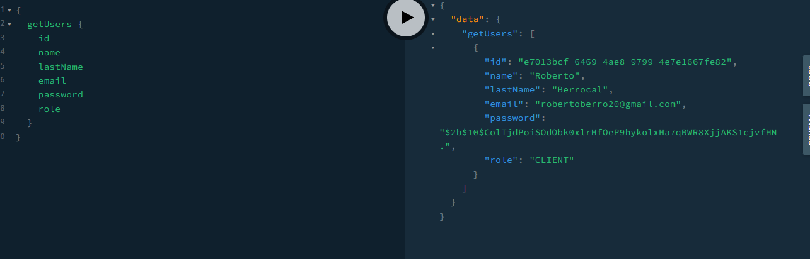
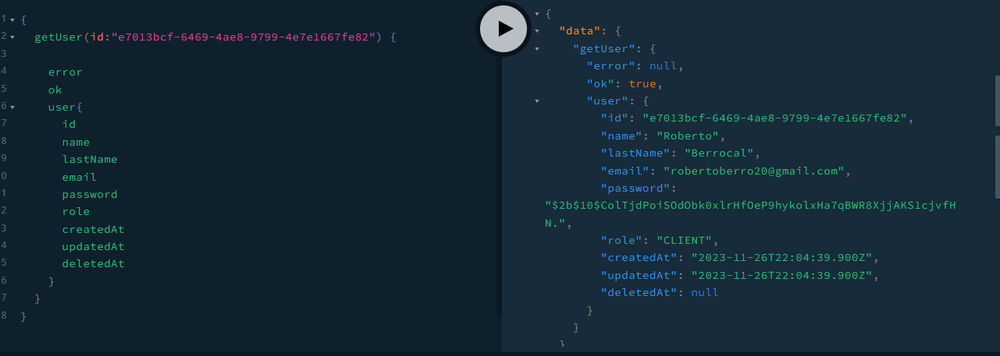
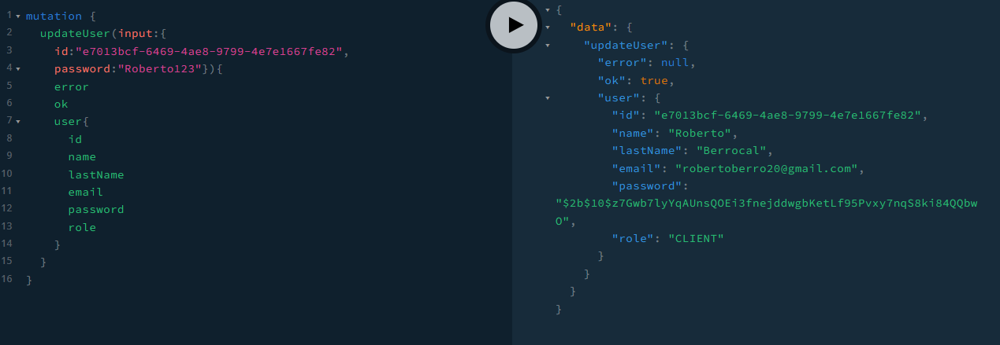
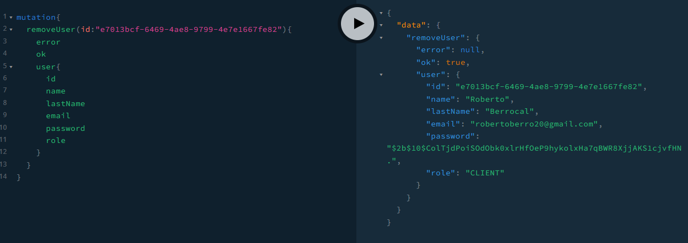

  

## Levantar el proyecto

Sigue estos pasos para levantar el proyecto:

1. Inicia XAMPP y asegúrate de que los servicios de Apache y MySQL estén activos.
2. Abre tu navegador web y ve a la siguiente URL: `http://localhost/final-project`.

¡Listo! Ahora deberías poder acceder al proyecto final del módulo 2 del diplomado.

## Evidences:

**User**:

create user:

get users:

get user:

update user:

delete user:

